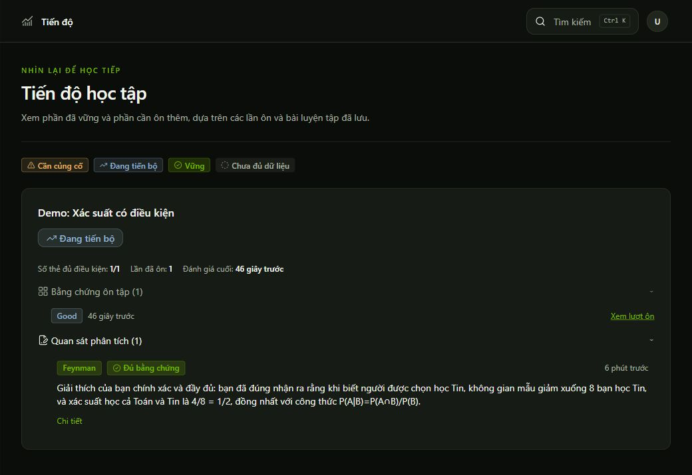

# Production verification — 2026-10-05

Target: https://actically.vercel.app/. The owner authorized a real browser journey using synthetic learning content. Existing authenticated browser cookies were used; a fresh signup/login was not performed. No secrets or personal learning material were sent to the AI.

## Browser journey actually completed

After the owner changed the Vercel database configuration, Review, Progress, Knowledge, Profile and Sessions loaded without reproducing the earlier intermittent server errors.

| Step | Observed result |
| --- | --- |
| Create study set | `Demo: Xác suất có điều kiện` saved |
| Create source | `Ghi chú mẫu: Xác suất có điều kiện`, revision 1, saved |
| Ask mode | Two real assistant replies returned; source example numbers were used. A formula-symbol error in the first reply was corrected after a follow-up. |
| Finish / extraction | Four source-grounded concepts persisted as pending; no automatic approval |
| Approval | Club example approved as concept revision 2 |
| Flashcard | Real generation saved a front/back card with source provenance |
| Feynman | Correct sample explanation saved, assessed with reference evidence, visible in history |
| Blurting | Deliberately incorrect sample saved; initial evaluation and one user-style retry were rejected as invalid AI output. The draft/history survived. |
| Review | Back hidden before reveal; Good rating saved; one history event; card left due queue |
| Progress | One eligible card, one review, one Feynman observation, `Đang tiến bộ`; persisted after full reload |

The four extracted concepts contain correct core formulas. Some draft text and Feynman observations mixed languages, and the first chat response contained a mistaken symbol. These are real model-quality findings, not a claim of perfect educational accuracy. Three concepts remain pending for human review. Test records are retained for the owner's demo.

## Local repairs following these findings

- Dismissed toast items no longer stay visible; the viewport's empty area does not intercept clicks. Removed the forced `data-state="open"` override.
- Protect LaTeX before Markdown consumes escape characters, support both dollar and bracket/parenthesis delimiters, and render math in tight list items. Inline code remains literal.
- Prompt revision `actically-learning-v2` reinforces Vietnamese output, source-checked formulas, single-question Socratic output, explicit Feynman score/finding requirements, short exact evidence, and null quote offsets. Blurting findings are kept concise rather than duplicating observations. Schema and evidence validation remain unchanged.

## Verification

- Local full offline suite: 122 passed; live checks remained opt-in.
- Two focused UI regression tests passed (dismissed toast markup and rendered KaTeX/protected code).
- Typecheck, lint and production build passed during repair validation.
- Real Nebius service checks used synthetic fixtures and the configured `nvidia/nemotron-3-super-120b-a12b` model. The added Blurting check passed. An initial extended run failed Socratic question-count and Feynman output requirements; prompts were tightened and both checks passed on the subsequent run. That run covered structured Solve, Socratic streaming, and Feynman correct/partial/incorrect ranking with validated evidence.

These real service tests are separate from the browser deployment and use local configuration. They do not prove the new prompt or UI repair is deployed. The Vercel browser journey above ran the prior code. The repairs must be pushed/deployed before rechecking Blurting retry, math rendering and toast dismissal on production. Fresh signup, full cross-user browser checks, live cancellation and a 375px production viewport were not exercised in this run. Do not treat one successful real-model evaluation as a guarantee against future invalid responses.
